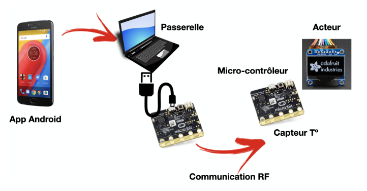
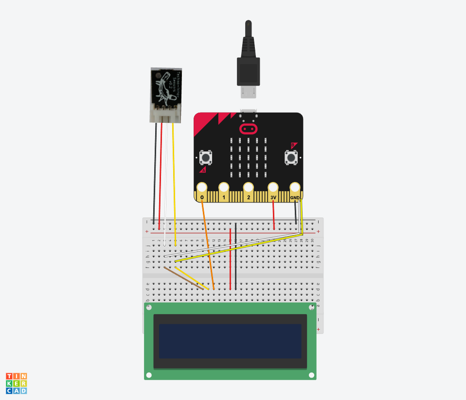

# Projet-IOT-4IRC

## Member

- **Elea MACHILLOT**
- **Adrien JAUFRE**
- **Romanin CHARDARD**
- **Elwan LEFEVRE**

## Project presentation

Our business wants us to develop box with a connected object with temperature and light sensor. Our goal is to print those information in every office that has one of these boxes. 
Moreover, people can access data through an Android data (sorry iPhone user :/) that is directly connected to a server. 

Here, we had to configure the object collecting data, server, android app and also the antenna.

We used an Android smartphone connected to wifi, a pc with two micro::bit (one for the antenna and another one for collecting sensor data).

## Project Architecture

The project is composed of 5 core element and an optional one :

- **Microbit capteur/** : Is used as a sensor to gather data and send them trough radio frequency
- **Microbit passerel/** : Is used as an antenna to receive data and send message to the sensor
- [**microbit-serial.py**](microbit-serial.py) : Is used as a gateway from the Microbit, the computer and the Android App 
- **App/** : Contain the Python API
- **appliAndroid/** : Contain the Android App

- [**discord_bot_iot.py**](discord_bot_iot.py) : Is used as a third service tool to set up the database and test the APi

All the project is based on the following schema : 

As for the micro::bit used to collect sensor, we created the shema : 

## Project statup

To start the project, you need to first start the [docker-compose.yaml](docker-compose.yaml) file.
The docker compose will start in the following order : 
- The postgreSQL database
- The API
- The Discord BOT

Set up the gateway account : 

Either `/setupapp` on the discord bot or 
`http://API_URL/user/app/`

Once the gateway account is set up, you can start the [microbit-serial.py](microbit-serial.py).
You can now use the application

## API

The API is used as a way to access data and store them in a PostgreSQL Data-Base.

The API is divided into 4 routers files and 

- **data.py** : Is used to manage data from the database
- **lumi.py** : Is used to manage luminosity from the database
- **temp.py** : Is used to manage temperature from the database
- **user.py** : Is used to manage the user account

## Database

The database is a PostgreSQL database. It is composed of 4 tables : 

- **user** : Contain all the user data
- **values** : Contain all the data

## Application

The application is an Android application. It is used to display data and manage the gateway account.
It is composed of 2 activities : 

- **MainActivity** : Is used to display the data
- **SetupActivity** : Is used to set up the gateway account

## Discord BOT

The Discord BOT is used as a third service tool to set up the database and test the APi.
It is composed of 3 commands : 

- **setupapp** : Is used to set up the gateway account
- **lumi** : Is used to display the luminosity data
- **temp** : Is used to display the temperature data
- **lasy_data** : Is used to display the last data

